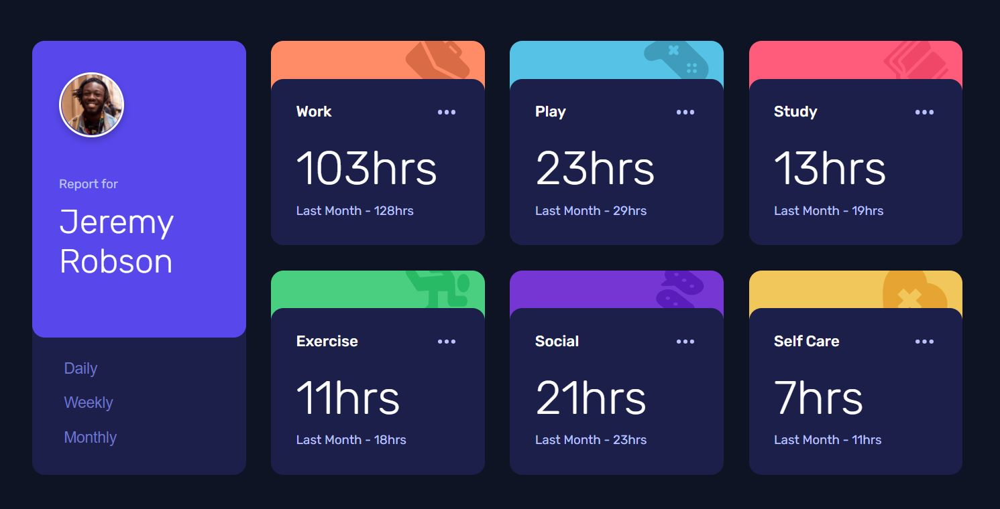

# Getting Started with Create React App

This project is a solution to the [Time tracking dashboard challenge on Frontend Mentor](https://www.frontendmentor.io/challenges/time-tracking-dashboard-UIQ7167Jw).

## Table of contents

- [Overview](#overview)
  - [The challenge](#the-challenge)
  - [Screenshot](#screenshot)
  - [Built with](#built-with)
  - [Links](#links)
- [Available Scripts](#available-scripts)
  - [npm run start](#npm-run-start)
  - [npm run test](#npm-run-test)
  - [npm run predeploy](#npm-run-predeploy)
  - [npm run deploy](#npm-run-deploy)
- [Acknowledgments](#acknowledgments)

## Overview

### The challenge

Users should be able to:

- View the optimal layout for the site depending on their device's screen size
- See hover states for all interactive elements on the page
- Switch between viewing Daily, Weekly, and Monthly stats

### Screenshot

\

### Built with

- Semantic HTML5 markup
- CSS custom properties
- Flexbox
- CSS Grid
- Mobile-first workflow
- [React](https://reactjs.org/) - JS library
- [gh-pages](https://create-react-app.dev/docs/deployment#github-pages) - Deployment to GitHub Pages

### Links

- Solution URL: [github.com/prpwien/time-tracking-dashboard](https://github.com/prpwien/time-tracking-dashboard)
- Live Site URL: [prpwien.github.io/time-tracking-dashboard](https://prpwien.github.io/time-tracking-dashboard)

## Available Scripts

In the project directory, you can run:

### `npm start`

Runs the app in the development mode.\
Open [http://localhost:3000](http://localhost:3000) to view it in your browser.

### `npm test`

Launches the test runner in the interactive watch mode.

### `npm run predeploy`

Builds the app for production to the `build` folder.\
It correctly bundles React in production mode and optimizes the build for the best performance.

The build is minified and the filenames include the hashes.\
The app is ready to be deployed!

See [Create-React-App]https://create-react-app.dev/docs/deployment#github-pages) for more information.

### `npm run deploy`

Publishes the app to the configured Github Page at `https://myusername.github.io/my-app`

See [Create-React-App]https://create-react-app.dev/docs/deployment#github-pages) for more information.

## Acknowledgments

Time Tracking Dashboard: \
[frontendmentor.io](https://www.frontendmentor.io/challenges/time-tracking-dashboard-UIQ7167Jw)
